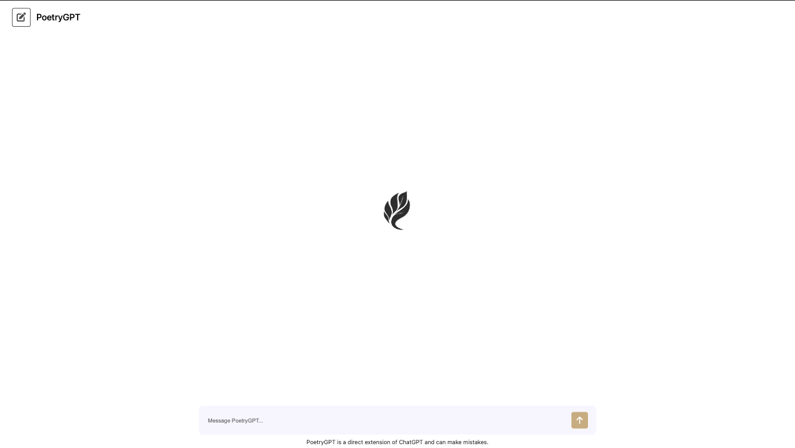

# PoetryGPT - Fine Tuned Model

## Project Overview

A fine-tuned ChatGPT Model that responds to prompts with poetry, built using Python, TypeScript and React

## Deployment Link

This chatbot is live, click [here](https://poetry-gpt.netlify.app/) to visit the site!

## Screenshot

## Fine Tune Model Creation

A link will be make accessible shortly that will provide the python programs necessary to train a finely-tuned model. 